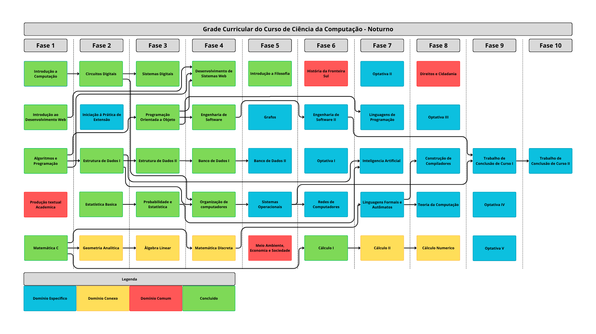
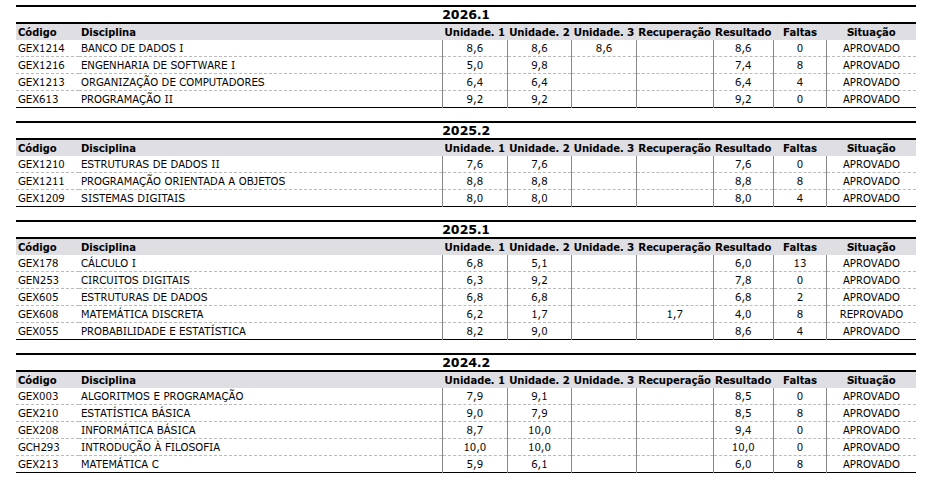

# Ciência da Computação - UFFS


|  |  |
|---|---|
| **Nome:** | Niumar Girardi |
| **Idade:** | 20 anos (24/02/2006) |
| **Curso:** | Ciência da Computação - Bacharelado (Noturno) |
| **Início:** | 2024.2 |
| **Semestre atual:** | 5º semestre - 2026.2 |


---

## Sobre o repositório

Aqui reúno **toda a minha jornada na UFFS**: atividades entregues, listas de exercícios, anotações de aula, provas e materiais de cada disciplina - tudo organizado por semestre.

A ideia é manter um registro histórico, acessível e versionado de tudo que produzo ao longo do curso. A pasta **`infoCurso/`** guarda os documentos gerais (PPC, boletim e o diagrama de progresso) e a pasta **`semestres/`** guarda o conteúdo de cada disciplina, separado pelo semestre em que foi cursada.

---

## Diagrama das matérias feitas

Grade curricular do **PPC 2025** com as disciplinas **concluídas destacadas em verde**:




### Equivalências:

Ingressei no **PPC 2017** e fui migrado para o **PPC 2025**. As disciplinas abaixo foram aproveitadas por equivalência, conforme o histórico oficial:

| Cursada (PPC 2017) | Equivale a (PPC 2025) |
|---|---|
| Matemática C `GEX213` | Matemática C `GEX1053` |
| Algoritmos e Programação `GEX003` | Algoritmos e Programação `GEX1206` |
| Informática Básica `GEX208` | Introdução à Computação `GEX1163` |
| Programação II `GEX613` | Introdução ao Desenvolvimento Web `GEX1205` |
| Programação II `GEX613` | Desenvolvimento de Sistemas Web `GEX1215` |
| Estatística Básica `GEX210` | Estatística Básica `GEX1047` |
| Circuitos Digitais `GEN253` | Circuitos Digitais `GEN504` |
| Estruturas de Dados `GEX605` | Estruturas de Dados I `GEX1207` |
| Probabilidade e Estatística `GEX055` | Probabilidade e Estatística `GEX1212` |
| Introdução à Filosofia `GCH293` | Introdução à Filosofia `GCH1740` |
| Cálculo I `GEX178` | Cálculo I `GEX1143` |

---

## Boletim




---

## Estrutura de pastas

```
UFFS/
├── README.md                                    # este arquivo
├── infoCurso/                                   # documentos gerais do curso
│   ├── boletim/
│   │   └── boletim26_1.png                      # print do boletim
│   ├── imgDiagramaPCC/
│   │   └── pcc25Diagrama_concluidas.png         # grade com as matérias concluídas
│   └── ppc/
│       └── PPC_Ciencia_da_Computacao_CH_2025.pdf   # Projeto Pedagógico do Curso
└── semestres/                                   # conteúdo por disciplina, 

Separado por Semestre
    ├── 1º Semestre/   (2024.2)
    │   ├── ALGORITMOS E PROGRAMAÇÃO/
    │   ├── ESTATÍSTICA BÁSICA/
    │   ├── INFORMÁTICA BÁSICA/
    │   ├── INTRODUÇÃO À FILOSOFIA/
    │   └── MATEMÁTICA C/
    ├── 2º Semestre/   (2025.1)
    │   ├── CÁLCULO I/
    │   ├── CIRCUITOS DIGITAIS/
    │   ├── ESTRUTURAS DE DADOS/
    │   ├── MATEMÁTICA DISCRETA/
    │   └── PROBABILIDADE E ESTATÍSTICA/
    ├── 3º Semestre/   (2025.2)
    │   ├── ESTRUTURAS DE DADOS II/
    │   ├── PROGRAMAÇÃO ORIENTADA A OBJETOS/
    │   └── SISTEMAS DIGITAIS/
    ├── 4º Semestre/   (2026.1)
    │   ├── BANCO DE DADOS I/
    │   ├── ENGENHARIA DE SOFTWARE I/
    │   ├── ORGANIZAÇÃO DE COMPUTADORES/
    │   └── PROGRAMAÇÃO II/
    └── 5º Semestre/   (2026.2)
        ├── CALCULO II/
        ├── LINGUAGENS DE PROGRAMAÇÃO/
        └── PRODUÇÃO TEXTUAL ACADEMICA/
```

Cada pasta de disciplina guarda os materiais daquele componente - por exemplo: `provas/`, `exercicios/`, `anotacoes/` e `trabalhos/`.

---

<div align="center">

**Niumar Girardi** · UFFS - Campus Chapecó · Ciência da Computação (Noturno) Última atualização: julho de 2026

_Documentando cada passo da graduação._ 

</div>
