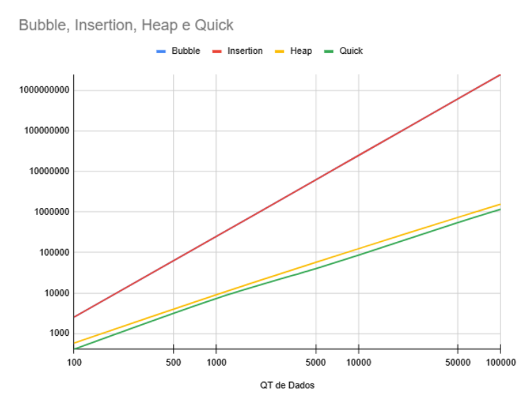
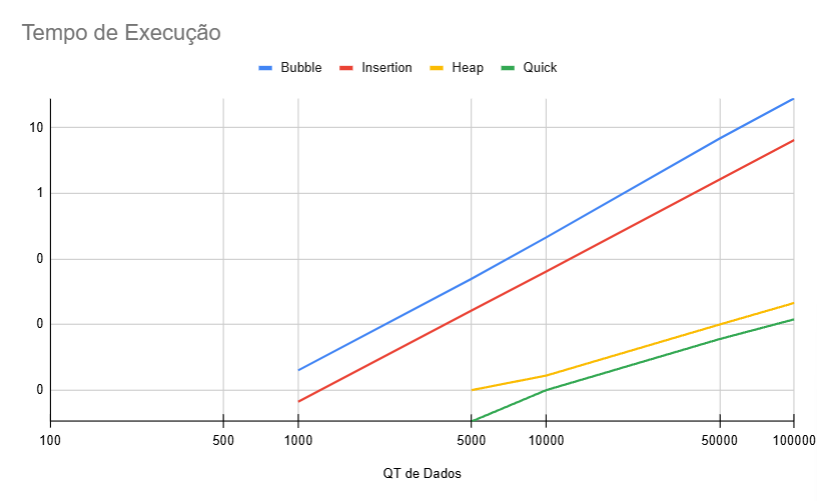

<!-- Title -->
<div align="center">

# Trabalho TP2 – POD / EDII (2025)

</div>

<!-- Header--> <br>
<div>

**Tema:** Comparação de Algoritmos de Ordenação     
**Professor:**  Guilherme Dal Bianco    
**Data de Entrega:** 24/10/2025  
**Autor(es):** Niumar Girardi e Leonardo Vitor Roth

## 🧠 Objetivo

O trabalho tem como objetivo **comparar o desempenho de quatro algoritmos de ordenação**:
- Bubble Sort  
- Insertion Sort  
- Heap Sort  
- Quick Sort  

A comparação considera:
1. **Número de trocas** realizadas.
2. **Tempo de execução médio** (com base em 3 execuções).

## 🧩 Metodologia

Os testes foram realizados com vetores de tamanhos:
100, 1.000, 5.000, 10.000, 50.000 e 100.000 elementos

Para cada tamanho, foram coletados:
- O número total de trocas
- O tempo médio de execução (em milissegundos)

O tempo foi calculado com base em 3 execuções consecutivas para reduzir variações.

</div>

<!-- Body --> <br>
<div>

## ⚙️ Estrutura do Código

O projeto está organizado em um arquivo principal (`main.c`) e em várias bibliotecas separadas dentro da pasta `libs/`, cada uma responsável por um algoritmo de ordenação ou função auxiliar.  

### 📁 Estrutura de Pastas

```
├── main.c  
└── libs/   
├── bubble/        
│ ├── bubble.h  
│ └── bubble.c  
├── insertion/  
│ ├── insertion.h   
│ └── insertion.c   
├── heap/   
│ ├── heap.h    
│ └── heap.c    
├── quick/  
│ ├── quicksort.h   
│ └── quicksort.c   
└── utils.h / utils.c
```


### 🧩 Descrição dos Arquivos

- **`main.c`**  
  É o arquivo principal do programa.  
  Ele:
  - Gera vetores de diferentes tamanhos (100 a 100.000 elementos).  
  - Exibe um menu interativo para o usuário escolher o tamanho do vetor e o algoritmo de ordenação.  
  - Copia o vetor original antes de ordenar, para manter os dados originais.  
  - Mede o tempo de execução e conta o número de trocas realizadas.  
  - Exibe os resultados formatados no terminal.  

- **`libs/bubble/`**  
  Contém a implementação do **Bubble Sort**, um algoritmo simples que compara pares de elementos adjacentes e os troca de posição até que o vetor esteja ordenado.  

- **`libs/insertion/`**  
  Implementa o **Insertion Sort**, que insere cada elemento na posição correta dentro de uma porção já ordenada do vetor.  

- **`libs/heap/`**  
  Implementa o **Heap Sort**, que transforma o vetor em uma estrutura de heap e realiza remoções sucessivas do maior elemento.  

- **`libs/quick/`**  
  Contém o **Quick Sort**, um algoritmo eficiente que utiliza o método de **divisão e conquista** (divide and conquer) para ordenar os dados.  

- **`libs/utils.h` e `utils.c`**  
  Contêm funções auxiliares, como:
  - `gerarNumerosAleatorios()` → cria vetores com valores aleatórios.  
  - `copia()` → faz cópias dos vetores originais antes da ordenação.  
  - `inicializarAleatorio()` → inicializa o gerador de números aleatórios com `time(NULL)`.

---

Durante a execução, o programa:
1. Gera todos os vetores aleatórios.  
2. Permite que o usuário escolha o tamanho e o algoritmo.  
3. Mede o tempo e as trocas do algoritmo selecionado.  
4. Exibe os resultados no console de forma organizada.  
5. Libera toda a memória alocada dinamicamente antes de encerrar.

---

## 📈 Resultados

Os testes foram realizados com vetores contendo **100, 1.000, 5.000, 10.000, 50.000 e 100.000 elementos**, sendo medidos:

- O **número total de trocas/operações**
- O **tempo médio de execução** (em segundos, considerando 3 execuções por caso)

Abaixo estão os gráficos comparativos obtidos:

### 📊 Gráfico 1 – Número de Trocas / Operações

Este gráfico mostra a quantidade média de trocas realizadas por cada algoritmo.  
É possível observar que **Bubble Sort** e **Insertion Sort** realizam muito mais operações que os demais, principalmente em vetores grandes.

<p align="center">
  
</p>

---

### ⏱️ Gráfico 2 – Tempo de Execução

Este gráfico representa o tempo médio de execução dos algoritmos conforme o tamanho dos vetores aumenta.  
O **Quick Sort** e o **Heap Sort** apresentam desempenho significativamente superior, com tempos quase imperceptíveis para grandes volumes de dados.

<p align="center">
  
</p>

---

📌 **Observação:**  
Os gráficos foram gerados a partir dos resultados coletados e salvos nos arquivos(`graficos`):
- `Graficos EDII - N° de Trocas_Operações.pdf`
- `Graficos EDII - Tempo de Execução.pdf`

## 💬 Conclusão

A partir dos resultados obtidos, é possível observar diferenças significativas de desempenho entre os quatro algoritmos de ordenação analisados:

### 🔢 Número de Trocas / Operações
- **Bubble Sort** e **Insertion Sort** apresentaram praticamente o mesmo número de trocas em todos os tamanhos de vetores.  
  Ambos possuem **complexidade O(n²)**, o que os torna ineficientes para grandes quantidades de dados.
- **Heap Sort** realizou **muito menos trocas** que os anteriores, demonstrando uma estrutura mais eficiente baseada em heap binário.
- **Quick Sort** apresentou o **menor número de operações** em praticamente todos os casos, confirmando seu bom desempenho prático.

### ⏱️ Tempo de Execução
- O **tempo de execução do Bubble Sort** cresce rapidamente à medida que o tamanho do vetor aumenta, atingindo cerca de **28 segundos** para 100.000 elementos.  
- O **Insertion Sort** foi um pouco mais rápido, mas também ineficiente em grandes entradas (≈ 6,5 s para 100.000 elementos).  
- O **Heap Sort** apresentou **tempos muito menores**, na faixa de milissegundos (≈ 0,02 s para 100.000 elementos).  
- O **Quick Sort** foi o **mais eficiente**, com o menor tempo médio em todas as amostras (≈ 0,012 s para 100.000 elementos).

### 📊 Considerações Finais
- Para **vetores pequenos**, as diferenças são pequenas, mas à medida que o número de elementos cresce, **Quick Sort e Heap Sort** se destacam.  
- O **Bubble Sort** e o **Insertion Sort** são algoritmos didáticos, adequados apenas para fins de demonstração.  
- **Quick Sort** obteve o melhor desempenho geral, confirmando sua eficiência prática e complexidade média **O(n log n)**.  
- Os resultados experimentais reforçam as análises teóricas de complexidade, mostrando que a escolha do algoritmo impacta diretamente a **velocidade e o custo computacional** da ordenação.

---


## 🧰 Como Executar

### 🔧 Requisitos
- Compilador **GCC** instalado (padrão em sistemas Linux e disponível no MinGW para Windows).  
- Todos os arquivos do projeto devem estar organizados na estrutura indicada anteriormente.

### ▶️ Compilação

No terminal, acesse o diretório onde o projeto está salvo e execute o comando:

```
gcc main.c libs/utils.c libs/bubble/bubble.c libs/heap/heap.c libs/insertion/insertion.c libs/quick/quicksort.c -o main
```

Esse comando compila o programa principal (`main.c`) junto com todas as bibliotecas dos algoritmos de ordenação.

### ▶️ Execução

Após a compilação bem-sucedida, execute o programa com:

```
./main
```

### Observações

- Durante a execução, o programa irá gerar automaticamente vetores de tamanhos diferentes (100 a 100.000 elementos).

- Em seguida, você poderá escolher qual tamanho de vetor e qual algoritmo de ordenação deseja testar.    

<br>
Ao final de cada execução, serão exibidos:

- O tamanho do vetor
- O algoritmo utilizado
- O tempo de execução
- O número total de trocas/iterações

</div>

<!-- Footer --> <br>
<div>

## 🧾 Licença

Este projeto foi desenvolvido como parte do **Trabalho Prático 2 (TP2)** da disciplina de **Programação e Organização de Dados / Estrutura de Dados II (POD / EDII)** — Universidade Federal da Fronteira Sul (UFFS), sob orientação do professor **Guilherme Dal Bianco**.

O código-fonte pode ser utilizado **livremente para fins educacionais**, estudo e comparação de algoritmos de ordenação, **desde que mantidos os devidos créditos aos autores**:

**Autores:**  
- Niumar Girardi  
- Leonardo Vitor Roth  

© 2025 — Todos os direitos reservados aos autores para uso acadêmico.


## ✨ Contato

Em caso de dúvidas ou sugestões sobre o projeto, entre em contato com os autores:

📧 **Niumar Girardi** — [niumar.girardi@estudante.uffs.edu.br](mailto:niumar.girardi@estudante.uffs.edu.br)  
📧 **Leonardo Vitor Roth** — [leonardo.roth@estudante.uffs.edu.br](mailto:leonardo.roth@estudante.uffs.edu.br)

Ou acesse nossos perfis no GitHub:  
- [github.com/NewtNiu](https://github.com/NewtNiu)
- [https://github.com/leonardo-roth](https://github.com/leonardo-roth)

---

📍 **Universidade Federal da Fronteira Sul (UFFS)**  
Curso de Ciência da Computação – Campus Chapecó  
Trabalho Prático 2 — POD / EDII — 2025

</div>


